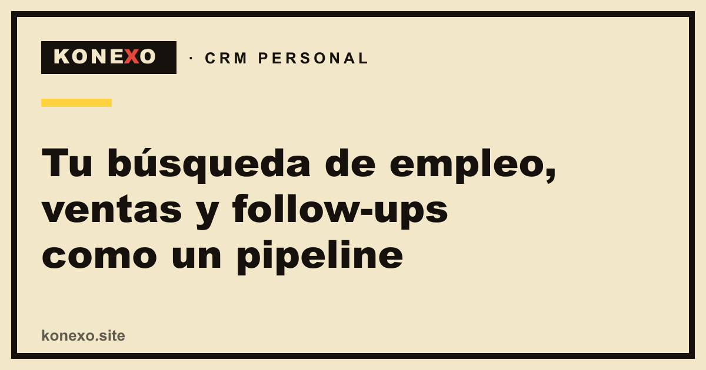
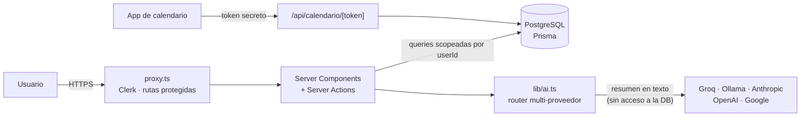

<div align="center">



# Konexo

**CRM personal con asistente de IA que organiza tu búsqueda laboral o tu negocio como un pipeline.**

[](https://github.com/Ezzeorazi/konexo/actions/workflows/ci.yml)


[](LICENSE)

[**🌐 Probalo en konexo.site**](https://konexo.site) · [Guía de uso](https://konexo.site/guia) · [Blog](https://konexo.site/blog)

</div>

---

Konexo es un producto real, en producción, diseñado y desarrollado de punta a punta por mí: desde el modelo de datos y la autenticación multi-tenant hasta el equipo de agentes de IA, la suite de tests y la publicación como app Android.

La misma estructura (**empresa/cliente → oportunidad → contacto → interacción**) se adapta a dos modos: **Búsqueda laboral** y **Tu negocio** (freelance o emprendimiento). Cada modo cambia el vocabulario, las etapas y las métricas de la app.

## Índice

- [Puntos destacados](#puntos-destacados)
- [Stack](#stack)
- [Funcionalidades](#funcionalidades)
- [Arquitectura](#arquitectura)
- [Seguridad](#seguridad)
- [Calidad: tests y CI](#calidad-tests-y-ci)
- [Correrlo localmente](#correrlo-localmente)
- [Backups y exportación](#backups-y-exportación)
- [Autor](#autor)

---

## Puntos destacados

Lo que muestra este repo, con enlaces al código:

| Área | Qué hice | Dónde mirar |
|---|---|---|
| **IA aplicada** | Router multi-proveedor (Groq, Ollama, Anthropic, OpenAI, Google) con key por usuario y un **equipo de agentes**: un orquestador coordina a un *Calificador* (prioriza oportunidades con tier y score) y a un *Redactor* (arma borradores en paralelo). | [`lib/ai.ts`](lib/ai.ts), [`lib/agent-team.ts`](lib/agent-team.ts), [`lib/agent-playbooks.ts`](lib/agent-playbooks.ts) |
| **Seguridad de LLMs** | Defensa contra *prompt injection*: los datos del usuario se delimitan y neutralizan antes de entrar al prompt. El modelo **no tiene acceso a la base**; solo recibe un resumen en texto armado del lado del servidor. | [`lib/prompt-safety.ts`](lib/prompt-safety.ts), [auditoría del asistente](AUDITORIA-ASISTENTE-IA.md) |
| **Multi-tenancy** | Aislamiento por `userId` en todas las consultas, con un único punto de identidad *fail-closed* y tests que verifican que un usuario no puede leer ni modificar datos de otro. | [`lib/auth.ts`](lib/auth.ts), [`tests/integration/multitenancy.test.ts`](tests/integration/multitenancy.test.ts) |
| **Criptografía** | Las API keys de los usuarios se guardan cifradas en la base con AES-256-GCM. | [`lib/crypto.ts`](lib/crypto.ts) |
| **Modelo de dominio flexible** | Un mismo esquema "vestido" por modo (vocabulario, etapas, forecast), con etapas editables por usuario. | [`lib/tracks.ts`](lib/tracks.ts), [`lib/stages.ts`](lib/stages.ts) |
| **Importación de datos** | Parser de Excel determinista (sin IA): deduplica, vincula contactos a empresas y reutiliza las mismas validaciones Zod que los formularios. | [`lib/excel-import.ts`](lib/excel-import.ts), [`lib/validation.ts`](lib/validation.ts) |
| **Interoperabilidad** | Feed iCalendar autenticado por token para suscribir los follow-ups desde el calendario del teléfono. | [`lib/ics.ts`](lib/ics.ts), [`app/api/calendario/[token]`](app/api/calendario/%5Btoken%5D/route.ts) |
| **Testing** | 234 tests en tres capas: unitarios, integración contra Postgres real en memoria (PGlite) y E2E con Playwright, incluyendo accesibilidad (axe) y Web Vitals. | [`TESTING.md`](TESTING.md), [`tests/`](tests) |
| **Producto completo** | Landing con SEO (sitemap, JSON-LD, blog en MDX), analítica de producto (PostHog), PWA y app Android (TWA) para Google Play. | [`app/`](app), [`content/blog/`](content/blog) |

---

## Stack

| Capa | Tecnología |
|---|---|
| Framework | Next.js 16 (App Router, Server Components, Server Actions), React 19, TypeScript |
| Datos | PostgreSQL (Neon) + Prisma 7 (`@prisma/adapter-pg`), migraciones versionadas |
| Auth | Clerk (multi-tenant), con usuario de desarrollo local cuando no hay keys |
| UI | Tailwind CSS v4, shadcn / Base UI, `@dnd-kit` para el Kanban |
| IA | Capa propia multi-proveedor, sin SDKs de terceros |
| Validación | Zod 4 |
| Testing | Vitest, PGlite, Playwright, axe-core |
| Infra | Vercel, GitHub Actions, PostHog |

---

## Funcionalidades

- **Dos modos sobre una misma base.** *Búsqueda laboral* (avisos → aplicada → entrevista → oferta) y *Tu negocio* (consulta → propuesta → negociación → en curso → cobrado, con monto y forecast ponderado). Se pueden activar los dos y cambiar de pipeline con un selector.
- **Kanban editable** con drag & drop y etapas configurables por usuario.
- **Asistente de IA que gestiona, no solo redacta.** Un chat que conoce tu embudo real: resume, prioriza y propone próximos pasos. Redactar mensajes es opcional y solo ocurre si lo pedís.
- **Equipo de agentes** que califica tus oportunidades abiertas y devuelve borradores listos para enviar.
- **Proyectos propios vs. de cliente**, con un botón *"Ponme al día"* que resume estado y próximos pasos.
- **Actividad unificada**: interacciones (email, llamada, reunión) y bitácora interna en un solo historial, más un checklist de tareas.
- **Seguimientos**: cada oportunidad y contacto tiene su próximo follow-up; los vencidos se marcan y suben de prioridad.
- **Calendario sincronizable** con el teléfono mediante un feed `.ics` privado.
- **Importación desde Excel** de empresas y contactos en bloque, con plantilla descargable.
- **Versiones de CV adaptadas por IA** a cada aviso.
- **Pomodoro y "Cierre del día"** con un repaso de lo que avanzaste, generado por IA.
- **Exportación de tus datos** a JSON y eliminación de cuenta.

---

## Arquitectura



- **Rutas:** zona pública (landing, guía, blog, legales, login) y zona privada `app/(app)/` con el CRM, protegida por [`proxy.ts`](proxy.ts) (el antiguo `middleware` en Next 16).
- **Mutaciones:** todas pasan por Server Actions que obtienen el usuario con `currentUserId()` y validan la entrada con Zod antes de tocar la base.
- **IA:** capa texto→texto **sin tool calling**. El servidor arma el contexto, el modelo devuelve texto y el código decide qué hacer con él. Un límite diario por usuario protege la key compartida ([`lib/ai-usage.ts`](lib/ai-usage.ts)).
- **Modos/tracks:** [`lib/tracks.ts`](lib/tracks.ts) define el vocabulario y las etapas de cada modo. Hay otros presets (inmobiliaria, fundraising, reclutamiento) que no se ofrecen hoy y se conservan por compatibilidad con datos históricos.

---

## Seguridad

- **Fail-closed en producción:** si faltan variables críticas (auth, base de datos, clave de cifrado), el build y el arranque fallan en vez de servir la app mal configurada ([`lib/env.ts`](lib/env.ts)).
- **Aislamiento de datos** por usuario en todas las consultas, cubierto por tests de integración.
- **Secretos cifrados** con AES-256-GCM; nunca se muestran completos en la UI.
- **Headers de seguridad:** CSP estricta, HSTS, `X-Frame-Options: DENY`, `nosniff`, `Permissions-Policy` ([`next.config.ts`](next.config.ts)).
- **Validación** de toda entrada con Zod, y defensa contra *prompt injection* en todo lo que llega al LLM.
- **Cadena de suministro:** CI con permisos mínimos y Dependabot para actualizaciones de dependencias.

Para reportar una vulnerabilidad y ver el runbook operativo (WAF, rate limiting, bot protection), consultá [`SECURITY.md`](SECURITY.md).

---

## Calidad: tests y CI

| Capa | Qué prueba | Tests | Comando |
|---|---|---:|---|
| Unitarios | Lógica pura (fechas, forecast, parser de Excel, prompt safety, iCal…) | 149 | `npm test` |
| Integración | Server Actions y rutas API contra Postgres real (PGlite en memoria) | 65 | `npm run test:integration` |
| E2E | Flujos en el navegador, accesibilidad (axe) y Web Vitals | 20 | `npm run test:e2e` |

En cada push y PR, [GitHub Actions](.github/workflows/ci.yml) corre lint, typecheck, las tres capas de tests y verifica que las migraciones se apliquen sobre Postgres sin *drift* respecto del schema. Más detalle en [`TESTING.md`](TESTING.md).

---

## Correrlo localmente

**Requisitos:** Node.js 20+ y una base PostgreSQL (local o, por ejemplo, [Neon](https://neon.tech)).

```bash
git clone https://github.com/Ezzeorazi/konexo.git
cd konexo
npm install                 # genera también el cliente de Prisma
cp .env.example .env        # en PowerShell: Copy-Item .env.example .env
# Editá .env y completá DATABASE_URL. Lo demás es opcional en desarrollo.
npx prisma migrate deploy   # crea las tablas
npm run db:seed             # (opcional) datos de ejemplo
npm run dev                 # http://localhost:3000
```

Sin keys de Clerk, la app corre con un usuario de desarrollo local. Para usar la IA, cargá una API key desde **Configuración** dentro de la app (la de [Groq](https://console.groq.com) es gratuita) o definí `GROQ_API_KEY` en `.env`. Todas las variables están documentadas en [`.env.example`](.env.example).

<details>
<summary><strong>Scripts disponibles</strong></summary>

| Comando | Qué hace |
| --- | --- |
| `npm run dev` | Servidor de desarrollo |
| `npm run build` / `npm run start` | Build de producción y servirlo |
| `npm run lint` | ESLint |
| `npm test` · `npm run test:integration` · `npm run test:e2e` | Tests por capa |
| `npm run test:all` | Unitarios + integración |
| `npm run db:migrate` | Crea y aplica migraciones en desarrollo |
| `npm run db:seed` | Siembra datos de ejemplo (se aborta si detecta producción) |
| `npm run db:backup` | Dump fechado de la base en `/backups` |

</details>

---

## Backups y exportación

- **Operador:** `npm run db:backup` genera un `pg_dump` fechado en `backups/` (ignorado por git). Requiere `pg_dump` con versión igual o mayor a la del servidor (Neon usa PostgreSQL 18); si no está en el `PATH`, se puede indicar con la variable `PG_DUMP`. Para restaurar: `psql "<connection-string>" -f backups/<archivo>.sql`, siempre primero sobre una base vacía o de prueba.
- **Usuario:** en **Configuración → Mis datos**, *Exportar a JSON* descarga todos sus datos, filtrados por su `userId`.

---

## Autor

**Ezequiel Orazi**, desarrollador full stack.

- Portfolio: [ezequiel-orazi.online](https://ezequiel-orazi.online)
- GitHub: [@Ezzeorazi](https://github.com/Ezzeorazi)

Si te interesa el proyecto o querés conversar sobre una oportunidad, escribime. Issues y PRs son bienvenidos (antes de un cambio grande, abrí un issue).

## Licencia

[MIT](LICENSE) © 2026 Ezequiel Orazi
